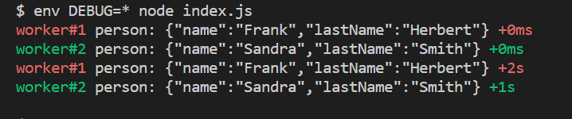
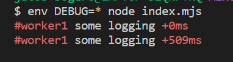

# @mango/debug

@mango/debug is an esm (and also a commonjs) ultra fast mini-logger written in typescript.

It was created because the current version of npm `debug` does not have an esm module.

## Highlights

- turn on/off logging namespace/scope logging in real time.
- works in web agent as-well in node
- optional tty colors or css colors separating different namespaces
- optional shows ms (humanized time) difference between logs
- optional shows full date time (for log files)
- lazy conversion from data to log string (only evaluates when it logs);

## Installation

```bash
npm i @mango/debug
```

### Quick Example

This example shows the main features

_index.js_

```typescript
import debug from './dist/esm/index.mjs';

// logger for namespace "worker#1"
const printer1 = debug('worker#1');

// logger for namespace "worker#2"
const printer2 = debug('worker#2');

const obj1 = { name: 'Frank', lastName: 'Herbert' };
const obj2 = { name: 'Sandra', lastName: 'Smith' };

printer1('person: %o', obj1); // first time "worker#1" logs

// wait 1 sec
await new Promise((resolve) => setTimeout(resolve, 1000));

printer2('person: %o', obj2); // first time "worker#2" logs

// wait 1 sec
await new Promise((resolve) => setTimeout(resolve, 1000));

printer1('person: %o', obj1); // second time "worker#1" logs, (2s after the prev log)
printer2('person: %o', obj2); // second time "worker#2" logs, (1s after the prev log)
```

Run it with:

```bash
env DEBUG=* node index.js
```

<div>output:</div>


## Concepts

### Terms

| term      | description                                                                  |
| --------- | ---------------------------------------------------------------------------- |
| printer   | a instance of a logger scoped by a namespace name on creation of the printer |
| namespace | a human identifiable name partitioning logging in your program               |

### Namespace & Printer

A printer is always associated with a namespace, and is created via the function `debug`.

A printer is an implementation of interface `Printer`.

How to create a printer

```typescript
function debug(ns: string): Printer;
```

Arguments:

- `ns`: namespace

Returns:

```typescript
export interface Printer {
  // the interface is callable
  (formatter: string, ...args: any[]): void;
  get color(): string;
  get diff(): number;
  get enabled(): boolean;
  get namespace(): string;
}
```

Properties on `Printer`:

- `color`: css or tty color for this logger, unless configuration option `DEBUG_COLORS` is set to `false`.
- `diff`: time difference (ms) since the last time this `Printer` was called.
- `enabled`: If this logger (namespace) is enabled or not. Enabling of a namespace depends on configuration option `DEBUG`.
- `namespace`: The namespace this logger belongs to.

**NOTE**: The single namespace can have multiple `Printer` instances, they all refer to the same `Printer`.

_index.js_

```typescript
import debug from '@mango/debug';

import assert from 'node:assert';

const printer1 = debug('#worker1'); // same namespace
const printer2 = debug('#worker1'); // same namespace

printer1('some logging');
await new Promise((resolve) => setTimeout(resolve, 500));

printer1('some logging');

assert(printer1.diff === printer2.diff); // same 0.5 sec
assert(printer1.enabled === printer2.enabled);
assert(printer1.color === printer2.color);
assert(printer1.namespace === printer2.namespace);
```

<div>output:</div>


## Configuration

### `DEBUG`

specify as:

- shell environment variable `DEBUG`
- entry in localStorage in `window.localStorage.setItem("DEBUG", "*,-queue")`

Contains a list of comma separated names or patterns of namespaces to allow logging for.

| value | description                                                  |
| ----- | ------------------------------------------------------------ |
| `*`   | wildcard:                                                    |
|       | `*` matches everything                                       |
|       | `worker*` matches namespaces starting with `worker`          |
|       | `*.disk` matches namespaces ending with `.disk`              |
| `-`   | negation:                                                    |
|       | `-accounts` does not match namespaces ending with `accounts` |

Example: allow all logging for all namespaces, except the ones ending with "accounts"

```bash
env DEBUG="*,-accounts" node index.js
```

#### Runtime override (web)

Change the value of `DEBUG` in localStorage and call the function `evalAllNS()` to re-evaluate the enabling of all existing printers.

```typescript
import { evalAllNS } from '@mango/debug';

window.localStorage.setItem('DEBUG', '*,-login'); // or do this manually in dev console
// must call this afterwards to effect changes
evalAllNS(); // re-evaluate currently existing Printers/Namespaces
```

#### Runtime override (node)

The `DEBUG` environment variable value is copied to an internal state at process startup. This internal value can be changed via `setConfig`

```typescript
import { setConfig } from '@mango/debug';

setConfig({ namespaces: '*,!-blog123' }); //this will override the value of "DEBUG".
```

### `DEBUG_COLORS`

Printers should use ansi colors (tty) or css colors (web dev console)

specify as:

- shell environment variable `DEBUG_COLORS`
- entry in localStorage in `window.localStorage.setItem("DEBUG_COLORS", "F")`

the value is a boolean string

Value will be regarded as true if it matches **case insensitive** comparison `"T"`, `"TRUE"` and false if it matches **case insensitive** comparison `"F"`, `"FALSE"`.

If `DEBUG_HIDE_DATE` is false, setting this value will have no effect.

The default value of `DEBUG_COLORS` will be taken as "true".

#### Runtime override (web)

Change the value of `DEBUG_COLORS` in localStorage and call the function `evalAllNS()` to re-evaluate the enabling of all existing printers.

```typescript
import { evalAllNS } from '@mango/debug';

window.localStorage.setItem('DEBUG_COLORS', 'F'); // or do this manually in dev console

// must call this afterwards to effect changes
evalAllNS(); // re-evaluate currently existing Printers/Namespaces
```

#### Runtime override (node)

The `DEBUG_COLORS` environment variable value is copied to an internal state at process startup. This internal value can be changed via `setConfig`.

```typescript
import { setConfig } from '@mango/debug';

setConfig({ useColors: false }); //this will override the value of "DEBUG_COLORS".
```

### `DEBUG_HIDE_DATE`

Printers should prefix any logging line with an ISO 8601 string.

specify as:

- shell environment variable `DEBUG_HIDE_DATEZ`
- entry in localStorage in `window.localStorage.setItem("DEBUG_HIDE_DATE", "F")`

the value is a boolean string

Value will be regarded as true if it matches **case insensitive** comparison `"T"`, `"TRUE"` and false if it matches **case insensitive** comparison `"F"`, `"FALSE"`.

#### Runtime override (web)

Change the value of `DEBUG_HIDE_DATE` in localStorage and call the function `evalAllNS()` to re-evaluate the enabling of all existing printers.

```typescript
import { evalAllNS } from '@mango/debug';

window.localStorage.setItem('DEBUG_HIDE_DATE', 'F'); // or do this manually in dev console

// must call this afterwards to effect changes
evalAllNS(); // re-evaluate currently existing Printers/Namespaces
```

#### Runtime override (node)

The `DEBUG_HIDE_DATE` environment variable value is copied to an internal state at process startup. This internal value can be changed via `setConfig`.

```typescript
import { setConfig } from '@mango/debug';

// equal to DEBUG_HIDE_DATE=true
setConfig({ showDate: false }); //this will override the value of "DEBUG_COLORS".
```

#### Query actively used config

Use the function `getConfig` to query the actively used config, (including runtime overrides)

```typescript
type Config = {
  namespaces: string; // see DEBUG
  showDate: boolean; // see DEBUG_HIDE_DATE
  useColors: boolean; // see DEBUG_COLORS
  web: boolean;
};

function getConfig(): Config;
```

Example:

```typescript
import { setConfig, getConfig } from '@mango/debug';

setConfig({ namespace: 'worker*' });

getConfig();
// ->
// {
//  namespaces: 'worker*',
//  showDate: false,
//  useColors: true,
//  web: false
// }
```
